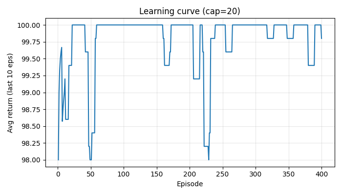
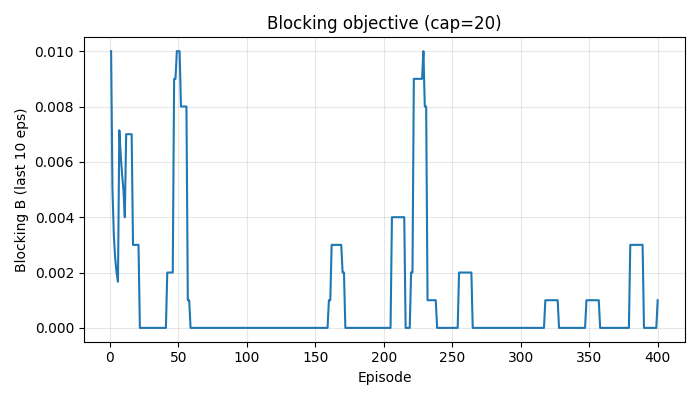
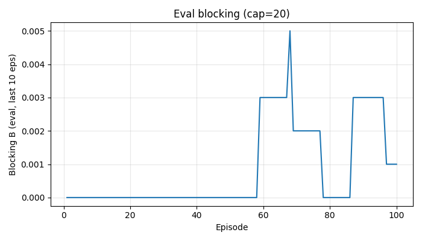
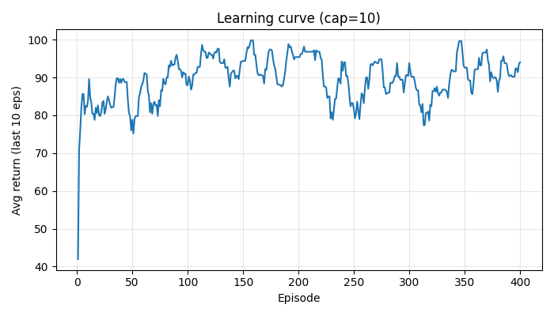
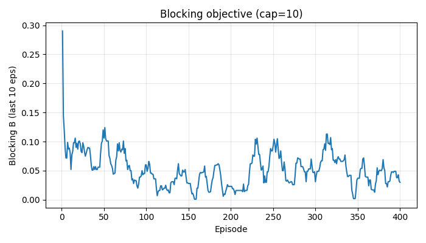
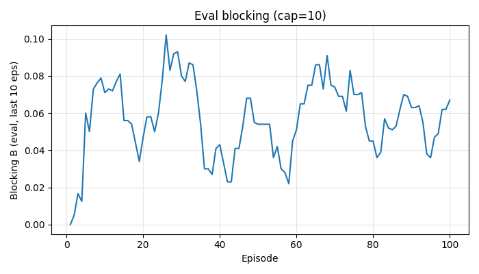

# Routing and Spectrum Allocation with DQN

This repo implements the CS 258 RSA project: a custom Gymnasium environment for routing and spectrum allocation, plus DQN training/evaluation using Stable-Baselines3.

## How to execute
- Python 3.12; install deps: `pip install -r project/requirements.txt`.
- Train and evaluate (capacity 20 then 10):  
  `python project/dqn_runner.py --train-dir project/data/train --eval-dir project/data/eval --output-dir runs --episodes 400 --seed 42`
- Only evaluate an existing model:  
  `python project/dqn_runner.py --train-dir project/data/train --eval-dir project/data/eval --output-dir runs --episodes 0 --eval-episodes 100 --seed 42`

## Environment
- **State**: Dict observation with `links` (binary occupancy matrix of shape `(11, capacity)`) and `request` `[src, dst, holding_time]`.
- **State transitions**: On each request arrival, pick a path, try first-fit wavelength across all edges (wavelength continuity + capacity), allocate if found, otherwise block. After each step all link timers decrement; expired wavelengths free. One episode processes exactly 100 requests from a CSV file.
- **Storage**: `LinkState` tracks endpoints, capacity, per-wavelength timers, and utilization; helpers live in `project/nwutil.py`.
- **Action**: `Discrete(2)` choosing the first vs second predefined path for the current (src, dst) pair.
- **Reward**: +1 accept, -1 block; objective B is episode block rate.
- **Constraints**: wavelength continuity, link capacity, and smallest-index color first.

## Training setup
- Uses `stable-baselines3` DQN (`MultiInputPolicy`) with replay buffer 50k, batch 128, tau 0.9, train_freq 4, target_update 1k, exploration_fraction 0.2, exploration_final_eps 0.05, defaults `learning_rate=1e-3`, `gamma=0.99` (see `project/dqn_runner.py`). SB3 reference: [Stable-Baselines3 docs](https://stable-baselines3.readthedocs.io/en/master/).
- Episodes: 100 timesteps (one request per step). Training samples only `project/data/train`; evaluation uses `project/data/eval` with deterministic `predict`.
- Optional quick hyperparameter sweep (`--tune`) over `(learning_rate, gamma)` grid; choose best mean block rate over last 10 episodes.
- Models saved as SB3 zip archives per SB3 save format guidance ([save format](https://stable-baselines3.readthedocs.io/en/master/guide/save_format.html)).

## Results
Six plots (auto-saved under `project/runs/cap_20` and `project/runs/cap_10` after training):
- Learning curves: `learning_curve_cap20.png`, `learning_curve_cap10.png` (10-episode moving average of returns).
- Training objective B: `blocking_curve_cap20.png`, `blocking_curve_cap10.png` (10-episode moving average of block rate).
- Eval objective B on `data/eval`: `eval_block_cap20.png`, `eval_block_cap10.png` (deterministic policy).

Embedded views:
- 
- 
- 
- 
- 
- 

## Files
- `project/rsaenv.py`: custom RSA Gymnasium environment.
- `project/nwutil.py`: topology, LinkState, request loading, and wavelength helpers.
- `project/dqn_runner.py`: training/evaluation pipeline and plotting.
- Data: `project/data/train` (train only), `project/data/eval` (evaluation only).

Word count < 1500 as required. For a concise enironment summary, see Gymnasium env description style at https://gymnasium.farama.org/environments/classic_control/cart_pole/.